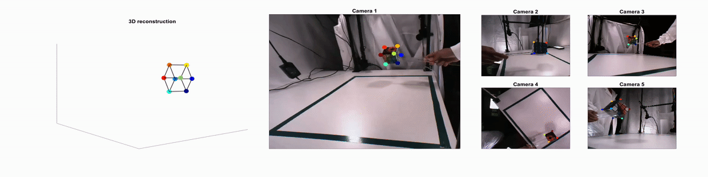

# 3D reconstrution toolbox for behavior tracked with multiple cameras 

## What is recon3D? 
recon3D is a toolbox for researchers working on computer vision based behavior tracking. Functions necessary to reconstruct behavioral features tracked from multiple cameras in 2D to 3D are provided with this toolbox. The core of this toolbox is a one shot implementation of triangulation for 3D reconstruction applicable to n cameras. It includes two main modes of 3D reconstruction to be selected based on the design of one's experiment.  The first mode uses, 2D data from all n cameras that are used to track the feature in 2D while the second mode selects the best camera pair for every time point and feature of interest. Furthermore, validation of the approach is included in example implementations showcasing the capabilities of the this toolbox. The examples also include illustration of 2D to 3D reconstruction workflow with preprocessing steps such as image undistortion, automatic selection of cameras containing well tracked 2D features and application of suitable temporal filters on the reconstructed 3D trajectories.

## Table of Contents
  * [Why recon3D?](#Why-recon3D)
  * [Running demo functions](#Running-demo-functions)
  * [Using the toolbox for your own data](#Using-the-toolbox-for-your-own-data)
  * [Tips for stereo camera calibration with Matlab](#tips-on-stereo-camera-calibration-with-Matlab)
  * [Dependencies](#dependencies)
  * [Installation](#installation)
  * [Citation](#citation)
  * [Acknowledgements](#acknowledgements)

## Why recon3D?

Behavior tracking in lab environments was recently revolutionized by [DeepLabCut (DLC)](https://github.com/AlexEMG/DeepLabCut): a markerless tracking software.
While DLC provides excellent tools for 2D tracking, scope for development of 3D reconstruction workflows especially for 2D behavior tracking made from more than two cameras still exists. [Anipose](https://github.com/lambdaloop/anipose) and [DLC](https://www.nature.com/articles/s41596-019-0176-0) offer implementations in python using OpenCV package in Python for camera calibration and 3D reconstruction. Camera calibration is a necessary step for 3D reconstruction in which checkboard images acquired from a camera are used to estimate its lens properties such as focal length and principal point. When checker board images are acquired simultaneous from 2 cameras, the position of one camera with respect to the other can also be obtained. In comparison to openCV, Matlab (The MathWorks Inc., Natick, Massachusetts), has a very user-friendly and graphical user interface (GUI) based camera calibration routine which makes camera calibration much easier to perform. recon3D takes advantage of this function in Matlab and provides a toolbox for 3D reconstruction of features tracked using DLC or any other 2D tracking software as illustrated in Figure 1. Given the popularity of Matlab in academia, we believe this toolbox will help make 3D reconstruction of tracked 2D behavior easier for researchers to use.

 
*Figure 1: Reconstruction in 3D of grasping behavior tracked in 2D using DeepLabCut*

## Running demo functions
1) Download the repository and from the main folder of the repository run **Demo_Rubikscube_other2d.m** to perform 3D reconstruction of corners of a standard Rubik's cube tracked in 2D using other tracking software. Here we mimick other software by manual 2D tracking.  
-- This example illustrates how to undistort images and perform 3D reconstruction using 2 modes of computation. In the first mode, 2D data tracked across all cameras is used for 3D reconstruction while in the second approach 3D reconstruction is performed pairwise across all camera pairs and finally averaged to get 3D coordinate of the feature. Since in this example, we track corners of a standard Rubik's cube (edge length 57mm), we can use this as ground truth to verify the accuracy of our 3D reconstruction. For this example, we show that using one-shot implementation of triangulation using all cameras provides significantly better results than when taking the trivial approach of averaging over pairs.

2) Simliar to the first example from the main folder of the repository, run **Demo_Rubikscube_DLC2d.m** to perform 3D reconstruction of corners of a standard Rubik's cube tracked in 2D using DLC.   
-- In addition to 3D reconstruction using DLC for 2D tracking, in this example we illustrate the usage of likelihood values obtained from DLC to automatically select best pair of cameras for every time point and feature of interest and also illustrate the usage of median filter to reduce outliers in the 3D reconstruction.

## Using the toolbox for your own data

Run the below functions in the following order from the main folder of this repository.  

1) Edit **template_config_your_experiment_DLC2d.m** file to enter your project specific information.  

2) Run **calibration_helper.m** in the helper functions folder to perform calibration and save stereoParams.mat file for your cameras. This function is semi-automated and the Matlab command windows prompts the user when input is needed from the user. The processes performed by this function are listed below.  
-- Copy your calibration videos or image frames into the folders that recon3D works with (user is prompted to select calibration videos for every primary-secondary camera pair)  
-- Extract image frames from videos and save into folders that stereoCameraCalibrator application can access for calibration (automatic : performed only when calib_videos is set to 1 in the corresponding config file. Otherwise, the image files for calibration are copied without running extract_frames function)  
-- StereoCameraCalibrator application is run for every primary-secondary camera pair sequentially (automatic)  
-- Running stereoCameraCalibrator launches a GUI. Wait for your calibration files to be loaded to the GUI and then click calibrate. After this check if the reprojection errors are at an acceptable level for your experiment (~0.25 pixels calibration error is allowed in our experiment). If not use GUI feature to select and remove outliers and recalibrate. (manual)  
-- When reprojection error is in acceptable range click export camera parameters. (manual)  
-- Close the GUI (no need to save session since the exported camera parameters will be saved in the next step automatically) and press any key to calibrate next pair of cameras.
-- The code saves stereoParams.mat file for recon3D. (automatic)  
(Step 2 described above is a must only for your first recording session.
Since the same calibration files will hold for all experiments when the cameras are fixed in place, you can skip this step from your second session onwards).  

3) Run **create_folders4yourdata.m** in the helper functions folder to select and copy your 2D tracked data into the folder structure for this toolbox.  

4) Run **template_your_experiment_DLC2d.m** to compute and save 3D reconstructed coordinates of your features of interest. 

## Tips on stereo camera calibration with Matlab
1) Our toolbox is designed to work with [stereoCameraCalibrator](https://www.mathworks.com/help/vision/ug/stereo-camera-calibrator-app.html) GUI in MATLAB.
2) Select a camera as your primary camera. Ensure that the selected primary camera is such that you can obtain checker board images simulataneously with the primary and every secondary camera in full view. 
3) In case you are acquiring images for calibration, ensure to save images into different folders with same file names as this is required by the stereoCameraCalibrator application.

## Dependencies 
In-built functions of Matlab, Computer Vision Toolbox. Code has been tested on MATLAB 2018b across linux, MAC and Windows operating systems.

## Installation
To install this toolbox, add all contents of this repository to Matlab path. 

## Citation
For questions on the toolbox and citation please contact us at swathishesh@gmail.com or HScherberger@dpz.eu

## Acknowledgements
We are very thankful to Mackenzie Mathis and Alexandar Mathis for their help in getting us going with using vision based tracking with DLC. Discussions with several colleagues at the German Primate Center including Andrej Fillipow, Michael Berger, Sebastian Mueller and Daniela Buchwald were very useful for the development of our tracking experimental setup. Thanks also to Viktorija Schek who helped with testing out some of our implementations. 

